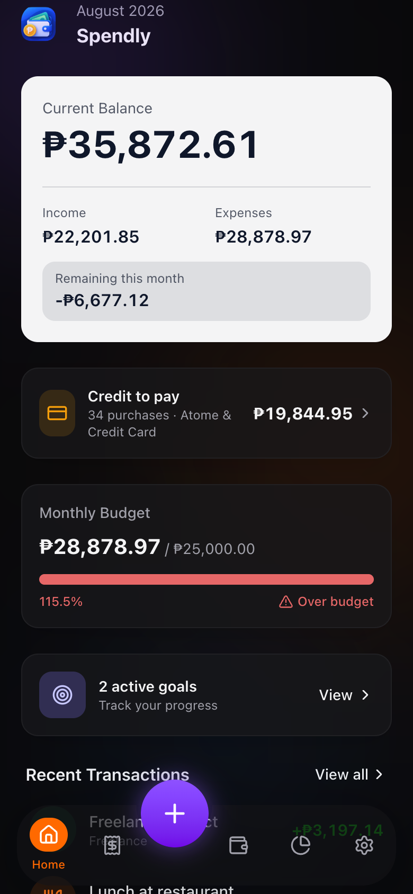
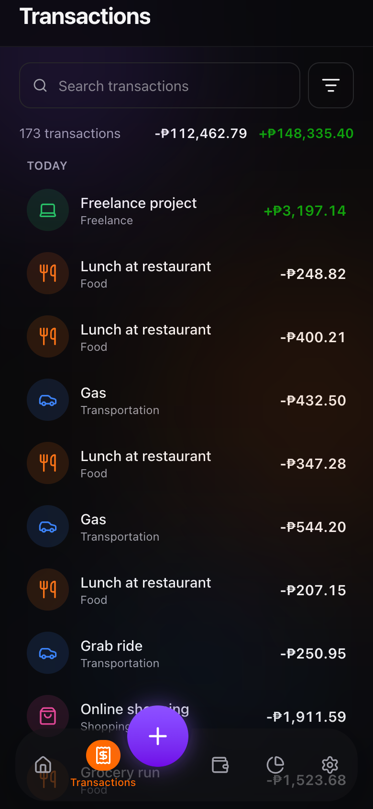
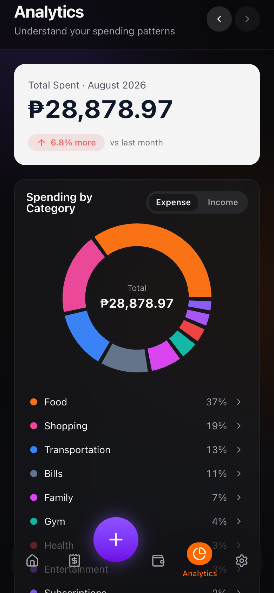
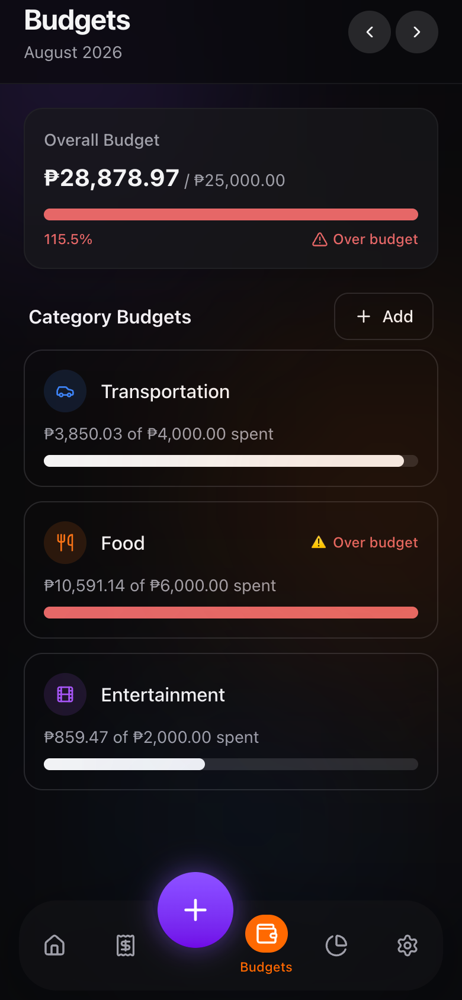
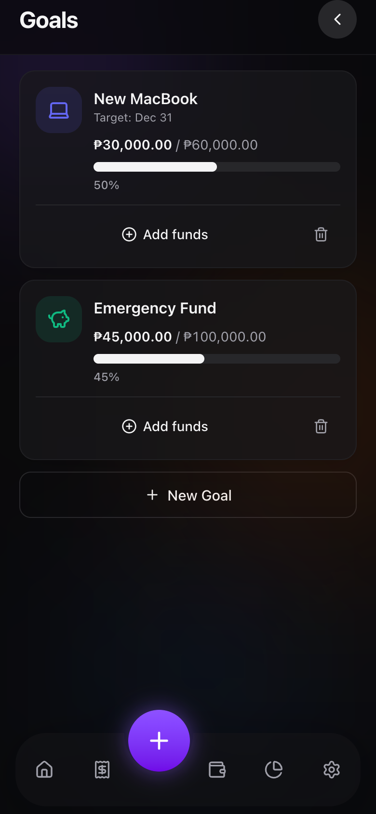
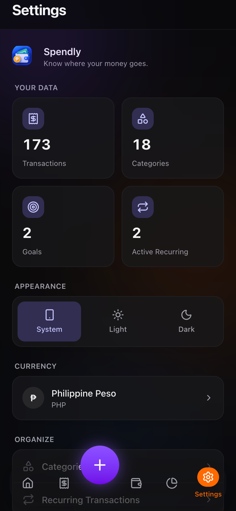

# Spendly

**Know where your money goes.**

Spendly is a private, offline-first personal finance Progressive Web App. It tracks income, expenses, budgets, and savings goals entirely on your device — no accounts, no servers, no tracking. Install it on your phone and it works exactly the same with the internet off.

<p align="center">
  
  
  
  
</p>

---

## Features

- **Dashboard** — current balance, monthly income/expenses, budget progress, and recent activity at a glance
- **Transactions** — fast add/edit, search, filter by category/type/date/payment method, grouped history
- **Categories** — sensible defaults for expenses and income, plus custom categories with icons and colors
- **Budgets** — an overall monthly limit and per-category limits, with over-budget warnings
- **Analytics** — spending-by-category donut chart, monthly income/expense bar chart, trend indicator, top categories
- **Goals** — savings goals with target amounts, target dates, and contribution tracking
- **Recurring transactions** — daily/weekly/monthly/yearly rules that generate transactions automatically, even after time offline
- **Export / Import** — back up all data to a single JSON file and restore it later, with validation
- **Installable PWA** — add to your home screen on iOS and Android, works fully offline
- **Light / dark / system themes**, PHP by default with room for more currencies

## Screenshots

<p align="center">
  <br />
  <sub>Home — balance, budget progress, recent activity</sub>
</p>

<p align="center">
  
  
  
</p>
<p align="center">
  <sub>Transactions &nbsp;·&nbsp; Budgets &nbsp;·&nbsp; Analytics</sub>
</p>

<p align="center">
  
  
</p>
<p align="center">
  <sub>Goals &nbsp;·&nbsp; Settings</sub>
</p>

---

## Tech Stack

- [React 19](https://react.dev) + [TypeScript](https://www.typescriptlang.org/)
- [Vite](https://vite.dev) for tooling and builds
- [Tailwind CSS v4](https://tailwindcss.com) for styling
- [Dexie.js](https://dexie.org) over IndexedDB for local persistence
- [Recharts](https://recharts.org) for charts
- [vite-plugin-pwa](https://vite-pwa-org.netlify.app) (Workbox) for the service worker & manifest
- [Lucide](https://lucide.dev) icons
- [Vitest](https://vitest.dev) + Testing Library for tests

No backend. No Firebase/Supabase/SQL. No external APIs.

---

## Architecture

Spendly is **local-first**: every read and write goes straight to IndexedDB through a Dexie database. There is no network layer in the critical path, so the app works identically online or offline.

```
src/
  components/   UI building blocks, grouped by feature (transactions, budgets, goals, ...)
  pages/        Route-level screens
  hooks/        Reactive data hooks (dexie-react-hooks live queries) — the read path
  services/     CRUD + business operations against the database — the write path
  db/           Dexie schema, default categories, demo data seeding
  types/        Shared TypeScript models
  utils/        Pure, unit-tested functions (money, dates, calculations, recurring logic, validation)
  lib/          Small framework-agnostic helpers (icons, colors, class merging, toast store)
```

Key decisions:

- **Money is stored as integer minor units** (centavos), never floats, to avoid rounding errors. `utils/money.ts` is the only place that converts to/from display values.
- **Hooks read, services write.** Pages call `services/*` to mutate data and `hooks/*` (backed by Dexie's `useLiveQuery`) to read it reactively — no manual refetching.
- **Pure calculation functions** (`utils/calculations.ts`, `utils/recurring.ts`, `utils/validation.ts`) contain all the financial logic and are covered by unit tests, independent of the UI or the database.
- **Recurring transactions** are generated by "catching up" from a rule's `nextOccurrence` up to today, run once when the app opens — reliable even after days offline, with no background process required.
- The data model already reserves transaction-type space for `transfer`/`refund` and a `securityLock` field for a future PIN/biometric lock, without those features being faked today.

---

## Local-First Philosophy

All financial data lives in your browser's IndexedDB, on your device, full stop. Spendly makes no network requests for your data — nothing is uploaded, tracked, or shared. There is no login because there is no server to log into. Your only copy of your data leaving the device is the JSON file you explicitly export.

If cloud sync is ever added, it will be layered on top of the existing `services/` boundary rather than requiring a rewrite of the data layer.

---

## Installing on Your Phone

Spendly is a PWA — it installs like a native app straight from the browser.

**Android (Chrome):**
1. Open the deployed Spendly URL in Chrome.
2. Tap **Install Spendly** when the in-app prompt appears, or open the browser menu (⋮) → **Install app**.
3. Spendly appears on your home screen and launches full-screen.

**iPhone (Safari):**
1. Open the deployed Spendly URL in Safari.
2. Tap the **Share** icon.
3. Tap **Add to Home Screen**.
4. Spendly appears on your home screen and launches full-screen, offline-capable.

---

## Development Setup

Requires Node.js 20+.

```bash
npm install
npm run generate-icons   # renders PWA icons from public/icon-*.svg (needs the sharp devDependency)
npm run dev
```

The dev server runs at `http://localhost:5173`.

### Build Commands

```bash
npm run build      # type-check (tsc -b) and produce a production build in dist/
npm run preview    # serve the production build locally to test the PWA/service worker
npm run lint        # ESLint
```

### Testing Commands

```bash
npm run test         # run the test suite once
npm run test:watch   # watch mode
```

Tests cover the financial logic in `src/utils/`: balance/income/expense totals, budget progress, category and monthly totals, percentage math, spending trend, recurring-transaction "catch up" logic, currency conversion, and import validation.

---

## Privacy Statement

- No analytics, no advertising, no third-party trackers.
- No external APIs are called for your financial data.
- All data stays in IndexedDB on the device you're using.
- Exporting is manual and explicit — a JSON file you control.

---

## Roadmap

- Optional PIN / biometric app lock (the `securityLock` field already exists in settings; no lock is implemented yet)
- Transfer and refund transaction types (the type system already reserves space for these)
- Additional currencies beyond the built-in list
- Optional, user-controlled cloud sync/backup

---

## License

MIT — see [LICENSE](./LICENSE).
